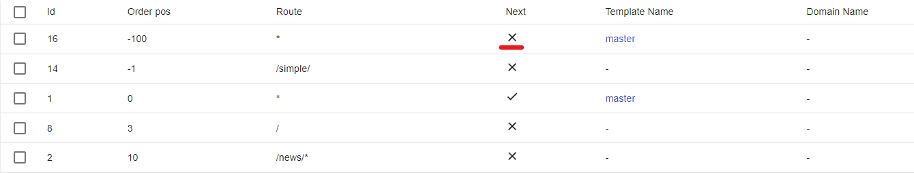

# Match & cascade merge

## Route match patterns
**Important!** ILC looks for an exact match on the route, this means that the content with the route `/` will be rendered only on the main page of the application. To bypass this, just add `*` after the route.

- `*` - displayed on all routes by default (if Order pos. and/or Domain name allows).

- `/` - displayed only on the main page of the application.

- `/news/*` - the content will be displayed on the `/news/` route and everything that will be written in the address bar after it(like `/news/blablabla`).

- `/wrapper/` - content will be displayed only on this route, if you add characters in the address bar after the route (like `/wrapper/blablabla`), the content will not be displayed.

## Route match priority (Order pos)

- The position can be used from minus infinity to plus infinity.

- ILC goes through positions from lowest to highest.

- Thus, if we try to access the `/simple/` route, in front of the main route, we will render content with the `*` route and the position `-100` because its position is less,
accordingly, content with route `*` and position `0` will not be rendered.

- If we go to the `/news/` route, in addition to it, both `*` routes will also be rendered.

**Important!** The `Next` parameter for pass-through routes must be set to `true`, otherwise (as in the screenshot below) the rendering will be stopped after the first element is rendered with the `Next` parameter with the `false` value.

