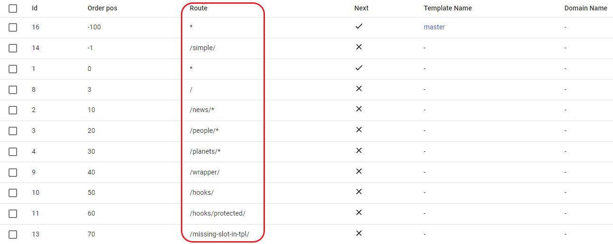
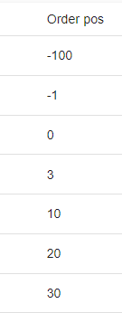
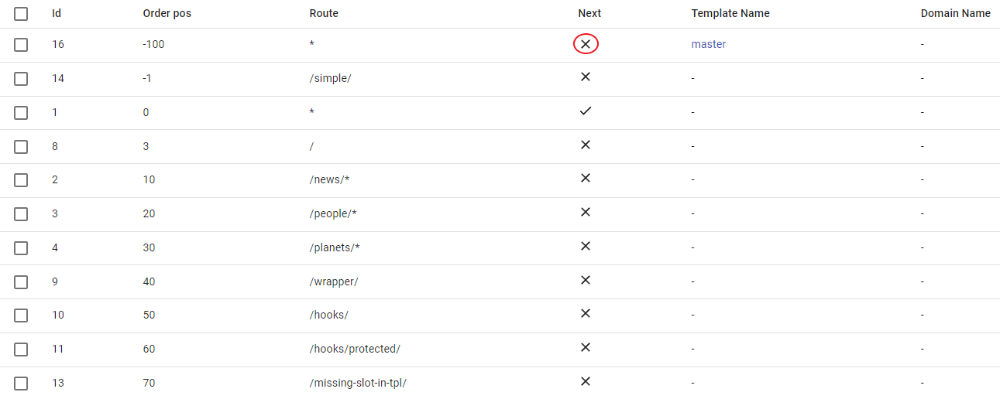
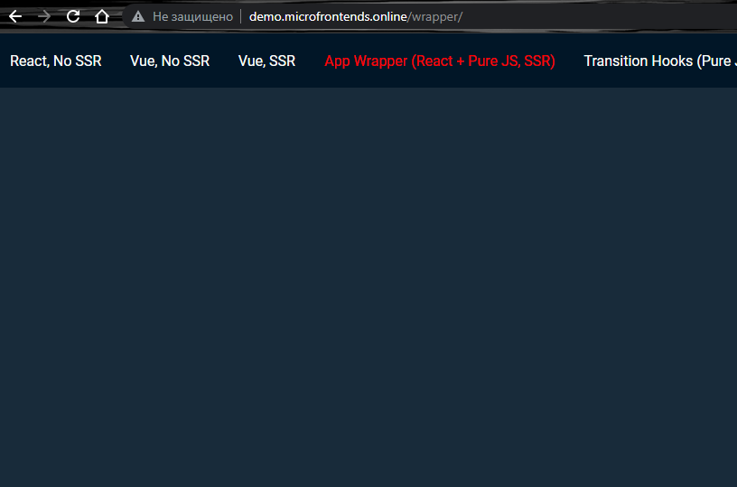
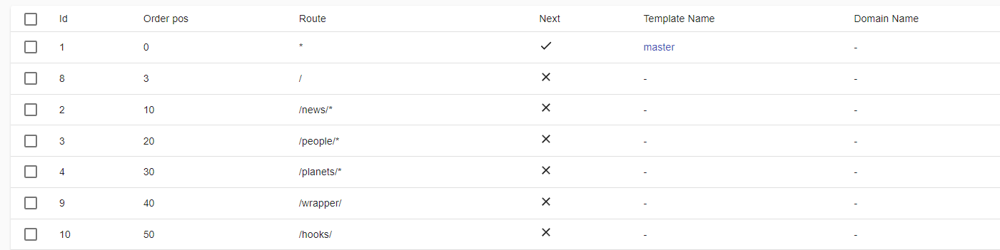
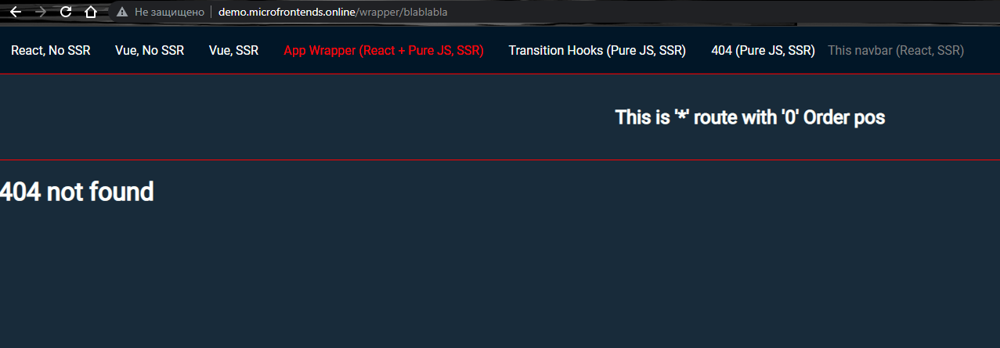
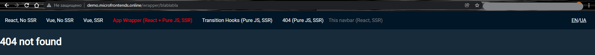

# Match & cascade merge

## Route field

- `*` - matches for any route.

- `/ `- matches only for home page.

- `/news/*` - matches for `/news/` route and any subroute (e.g. `/news/blablabla`).

- `/wrapper/` - matches only for `/wrapper/` route and ignores for any subroute (e.g. `/wrapper/blablabla`).

- Route must be unique for each domain (we can use the same order position, provided that the domain names are different).

## Order field

- Only integer numbers are allowed, from minus infinity to plus infinity.

- ILC goes through positions from lowest to highest.

- Order positions must be unique for each domain (we can use the same order position, provided that the domain names are different).

## Next field

- It can be set to `true` or `false`

- If it is `true` the ILC will render the content and go to the next route.

- If it is `false` the ILC will render the content and **will not proceed** to the next route.

## Examples:

- Suppose we need to render the page without `navbar`, in this case, we need to set the` Order pos` for this route less than that of `navbar`, in our case `navbar` has `Order pos -100`, set our route accordingly (let this will be `/wrapper/`) `Order pos -101` and set `Next` field to `false` value. So ILC will start with the application with the lowest value of `Order pos`, in this case it is `-101`, because its route match it will be rendered, but the `Next` field is set to `false`, so the ILC will not look for matches further, so only one application will be rendered for us.

**Result:**

#

- Now let's change back value `Order pos` of `/wrapper/` to `40` as in the screenshot below, and again try to enter the `/wrapper/` route, ILC will start from the application with the lowest `Order pos` value,
in this case it is `-100`, because its route is `*` it will be rendered, and since the `Next` field is set to `true` ILC will go further along the order, `Order pos -1` **will not be rendered** because the `/simple/` route does not match the given one, we move further to position `0`, render this application because its route `*` and move on, because the `Next` field is set to `true`, next few applications will not be rendered, because their route does not match the specified one, until we reach the position `40`, its route exactly matches the specified one, the application will be rendered, and because `Next` is set to the value `false` ILС will not look for matches further. In total, we will render 3 applications, both routes `*` and route `/wrapper/`.

**Result:**

#

- Now let's go to the route `/people/blablabla/`, since in the ILC registry we have the value `/people/*` - ILC will render both routes `*` and the route `/people/*`

**Result:**

#

- And the last example, let's go to the route `/wrapper/blablabla/` route, we will render [Error](https://github.com/namecheap/ilc/blob/master/docs/global_errors_handling.md#404-error-not-found), because the specified route does not exactly match our routes, аnd all other routes (like `*`) will be ignored (in this case `navbar` it's part of [Error](https://github.com/namecheap/ilc/blob/master/docs/global_errors_handling.md#404-error-not-found), **not** our route `*` with `Order pos - 100`).

**Result:**

