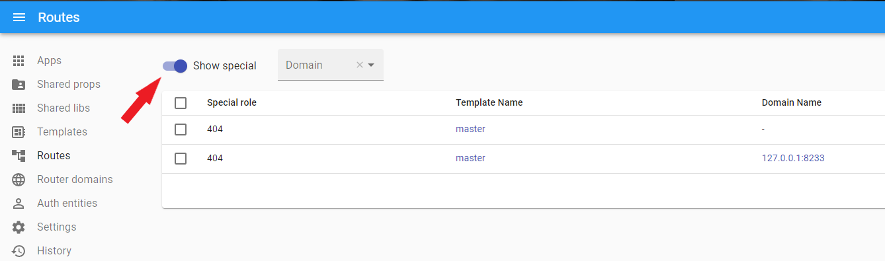

# Special routes

## 404

- To see special routes, use the switcher.

- It is used to render errors, if an application with the `Primary` or `Essential` type falls on the page, ILC will not find a match between the address bar and `Route`, `Template` will not be specified in the route chain, etc., ILC will use `Special route`.

- When using `Special route` all standard routes are ignored, including `*` with any `Order pos`

- `Special route` must have a `Template`.

- `Special route` must be created separately for each domain.

## Examples:

- Let's go to the `/wrapper/blablabla/` route, ILC will render [Error](https://github.com/namecheap/ilc/blob/master/docs/global_errors_handling.md#404-error-not-found), because the specified route does not exactly match our routes, аnd all other routes (like `*`) will be ignored (in this case `navbar` it's part of [Error](https://github.com/namecheap/ilc/blob/master/docs/global_errors_handling.md#404-error-not-found), **not** our route `*` with `Order pos - 100`).

**Result:**

